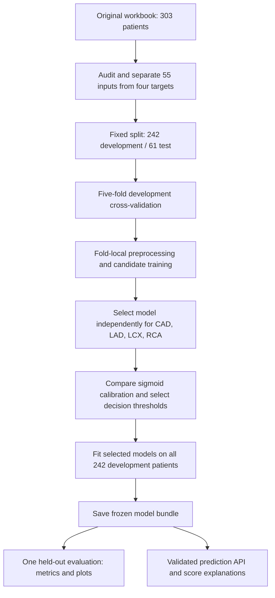

# CardioVista AI

Explainable coronary disease classification in Python. A saved bundle predicts four binary labels: overall CAD and LAD, LCX, and RCA stenosis. The local API supplies probabilities, selected thresholds, input-quality flags, and optional patient explanations for a future dashboard and 3D heart viewer.

For step-by-step Windows startup, saved-model prediction, API usage, and retraining instructions, see [HOW_TO_START.md](HOW_TO_START.md).

## Dataset

The official [UCI Extension of Z-Alizadeh Sani dataset](https://archive.ics.uci.edu/dataset/411/extention+of+z+alizadeh+sani+dataset) is saved at `data/raw/z_alizadeh_sani_extension.xlsx`. It has 303 patients, 55 candidate clinical inputs, and four labels. Use worksheet `Sheet 1 - Table 1`.

Dataset creators: R. Alizadehsani, M. Roshanzamir, and Z. Sani. Dataset license: CC BY 4.0; DOI: 10.24432/C5461K. The dataset license does not automatically assign a license to this project's code.

`Cath`, `LAD`, `LCX`, and `RCA` are always excluded from predictors. The original file is preserved. The audit reports one inconsistent CAD/vessel label record without relabeling it; `Exertional CP` is constant, and training-only filters remove constant predictors. `Fmale` is normalized to `Female`. Extremely rare categories have limited supporting data.

## ML pipeline



The development/test split is approximately **80% / 20%**. Within each cross-validation fold, approximately **64% of the full dataset trains the model, 16% validates it, and 20% remains held out**. Validation membership rotates across five folds; there is no separate permanent 16% validation partition. The final selected models are fitted on all 242 development patients, leaving the same 61 test patients excluded from training.

| Stage | Implementation |
| --- | --- |
| Data audit | Check workbook structure, labels, missing values, duplicates, constants, and label inconsistencies; preserve the raw source. |
| Feature boundary | Use 55 approved clinical inputs; exclude `Cath`, `LAD`, `LCX`, `RCA`, identifiers, and target-derived features. |
| Shared preprocessing | Normalize categories, remove constants learned from the training fold, fill numeric nulls with training medians, and fill categorical nulls with a missing sentinel. |
| Logistic regression | Standardize numeric inputs and one-hot encode categories in a scikit-learn pipeline. |
| CatBoost | Use native categorical inputs and gradient-boosted decision trees; no numeric scaling is required. |
| Candidate search | Per target: one dummy baseline, six logistic configurations, and eight CatBoost configurations; 60 candidates across four targets and 300 five-fold fits before calibration comparisons and final fits. |
| Hyperparameters | Logistic `C`: 0.1, 1, 10, with/without balanced class weights; CatBoost depth: 3 or 5, iterations: 200 or 400, with/without balanced class weights. |
| Model selection | Use development ROC-AUC, simplicity/tie rules, and log loss. Select each target independently. |
| Calibration and thresholds | Compare nested sigmoid calibration using out-of-fold predictions; choose thresholds by development out-of-fold F1. The current baseline retained no calibration for all four targets. |
| Persistence | Save four models together with their preprocessing, thresholds, schema, runtime versions, and SHA256 integrity metadata. |
| Inference | Validate the complete input, load the saved bundle, and return four probabilities, labels, quality flags, and optional explanations. |

Training uses **CPU**. CAD and LAD selected logistic regression; LCX and RCA selected CatBoost. The complete training configuration is in [configs/training.json](configs/training.json).

## ML tools and libraries

| Tool | Role in this project |
| --- | --- |
| Python 3.12 | Training, evaluation, inference, and command-line workflow |
| pandas and openpyxl | Read the Excel dataset and handle tabular clinical inputs |
| NumPy and SciPy | Numerical operations, probability transforms, and explanation calculations |
| scikit-learn | Pipelines, preprocessing, logistic regression, dummy baseline, cross-validation, calibration, and metrics |
| CatBoost | Boosted-tree classification with categorical features and native tree SHAP explanations |
| Matplotlib | Saved confusion-matrix, ROC, precision-recall, and reliability plots |
| joblib | Serialize and load trusted model bundles |
| FastAPI, Pydantic, and Uvicorn | Validated local prediction API, schema endpoints, and API explorer |
| pytest | Regression checks for data boundaries, leakage prevention, inference, explanations, and API behavior |

## Setup on Windows

Use Python 3.12 for the tested dependency lockfile and saved models. From this project folder:

```powershell
py -3.12 -m venv .venv
.\.venv\Scripts\python.exe -m pip install -r requirements.lock.txt
.\.venv\Scripts\python.exe -m pip install --no-deps -e .
```

The working project already has `.venv`. Activation is optional; invoking its Python directly avoids PowerShell execution-policy changes. The lockfile describes the tested environment. Serialized models require matching numerical-library versions and trusted local artifacts.

## Reproduce training

```powershell
.\.venv\Scripts\python.exe -m cardio_risk.cli audit
.\.venv\Scripts\python.exe -m cardio_risk.cli split
.\.venv\Scripts\python.exe -m cardio_risk.cli train --config configs/training.json --run-id baseline-v1
.\.venv\Scripts\python.exe -m cardio_risk.cli evaluate --run-id baseline-v1
```

The completed run lives in `artifacts/baseline-v1` and `reports/baseline-v1`. Training refuses to overwrite an existing run. Evaluation refuses to repeat into a run that has already begun evaluation. Read `test_metrics.json` to inspect existing results. An interrupted run is retained for diagnosis. If restarting training, use a new run ID and disclose reuse of the same test set after its results have been seen.

The shared fixed split uses 242 development and 61 held-out patients, stratified on CAD with seed 42. Development-only five-fold comparison evaluates a dummy prevalence baseline, six regularized logistic regression settings, and eight CatBoost settings per target. Numeric imputation, scaling, category encoding, and constant filtering are fitted independently within training folds.

Candidates are selected by ROC-AUC with a 0.01 tie preference for logistic regression, then log loss and lower capacity. Selected models compare raw probabilities with nested three-fold sigmoid calibration using development OOF predictions. Calibration is retained only for a Brier improvement of at least 0.005 without worse log loss. Per-target thresholds maximize development OOF F1, with recall and proximity to 0.5 resolving ties.

Development scores are model-selection estimates. Final held-out reports include accuracy, precision, recall, specificity, F1, ROC-AUC, average precision, Brier score, log loss, confusion matrices, and conditional bootstrap intervals. The evaluated bundle stays fitted on development data; it is not silently replaced with an all-data refit.

## Baseline-v1 results

The exact saved bundle was evaluated once on 61 held-out patients:

| Target | Model | Accuracy | Precision | Recall | F1 | Specificity | ROC-AUC |
|---|---|---:|---:|---:|---:|---:|---:|
| CAD | Logistic regression | 78.69% | 89.47% | 79.07% | 83.95% | 77.78% | 0.9134 |
| LAD | Logistic regression | 72.13% | 67.35% | 97.06% | 79.52% | 40.74% | 0.8170 |
| LCX | CatBoost | 60.66% | 52.63% | 76.92% | 62.50% | 48.57% | 0.7022 |
| RCA | CatBoost | 62.30% | 45.95% | 85.00% | 59.65% | 51.22% | 0.7488 |

The vessel operating points favor recall and produce many false positives. RCA accuracy is below its majority-class dummy baseline (67.2%), despite better ROC-AUC, positive-case recall, and probability loss. These thresholds were selected on development data, not adjusted after seeing these results. All four retained uncalibrated probabilities under the predeclared calibration rule.

See `reports/baseline-v1/model_card.md` for approximate intervals and limitations, `test_metrics.json` for complete metrics/baselines, and `figures/` for the evaluation plots. Warm local HTTP prediction latency over 50 requests was about 60 ms median and 83 ms p95 on an Intel Core i7-13620H with 16 logical processors. The live API matched local inference, including explanations. Rebuilding each model from its saved parameters reproduced development probabilities exactly.

## Predict from a file

`examples/synthetic_patient.json` contains an illustrative synthetic record; it is not a copied patient or a diagnostic example.

```powershell
.\.venv\Scripts\python.exe -m cardio_risk.cli predict --run-id baseline-v1 --input examples/synthetic_patient.json
.\.venv\Scripts\python.exe -m cardio_risk.cli predict --run-id baseline-v1 --input examples/synthetic_patient.json --explain
```

In Python:

```python
import json
from pathlib import Path
from cardio_risk.predict import load_bundle, predict_record

bundle = load_bundle(Path("artifacts/baseline-v1"))
patient = json.loads(Path("examples/synthetic_patient.json").read_text())
result = predict_record(bundle, patient["features"], include_explanations=True)
print(result["predictions"])
```

All 55 feature keys must be provided using the schema's original column names. Explicit `null` marks a missing value; at most 11 nulls are accepted. Missing keys, unknown categories, target/extra keys, numeric strings, booleans as measurements, and nonfinite numbers are rejected. Finite measurements outside development ranges receive warnings and are not clipped. Numeric nulls use training medians and categorical nulls use a missing sentinel. Units remain unset until independently verified; do not infer lab units from values.

## Local API

```powershell
$env:CARDIO_ARTIFACT_DIR = (Resolve-Path 'artifacts/baseline-v1').Path
.\.venv\Scripts\python.exe -m uvicorn cardio_risk.api:app --host 127.0.0.1 --port 8000
```

Open `http://127.0.0.1:8000/docs` for the API explorer. Routes:

- `GET /health`: loaded version and artifact hash.
- `GET /schema`: required feature names, types, categories, missing-input policy, and development ranges.
- `POST /predict`: `{"features": {...}, "include_explanations": false}`.

From another PowerShell terminal:

```powershell
$patient = Get-Content 'examples/synthetic_patient.json' -Raw
Invoke-RestMethod -Uri 'http://127.0.0.1:8000/predict' -Method Post -ContentType 'application/json' -Body $patient
```

Invalid requests return 422. Missing or incompatible model artifacts prevent startup. There are no fabricated fallback predictions, external services, or database requirements.

## Explanations and visualization handoff

### Available ML evaluation visualizations

Each target has a saved four-panel evaluation figure:

| Plot | What it shows |
| --- | --- |
| Confusion matrix | True/false positive and negative counts at the selected threshold |
| ROC curve | Sensitivity versus false-positive rate across thresholds, with ROC-AUC |
| Precision-recall curve | Positive-prediction precision versus positive-case recall |
| Reliability plot | Observed positive frequency versus predicted probability across bins |

Open the generated figures: [CAD](reports/baseline-v1/figures/cad_evaluation.png), [LAD](reports/baseline-v1/figures/lad_evaluation.png), [LCX](reports/baseline-v1/figures/lcx_evaluation.png), and [RCA](reports/baseline-v1/figures/rca_evaluation.png). These are static Matplotlib plots generated during held-out evaluation. Read the existing figures rather than rerunning an already completed evaluation.

Development-wide feature attribution rankings are saved in [global_attributions.json](reports/baseline-v1/global_attributions.json), using mean absolute model-score contributions. Per-input explanations are available through the CLI `--explain` option and API `include_explanations`; an interactive attribution chart has not yet been implemented.

### Model explanations and future 3D integration

CatBoost uses native tree SHAP. Logistic regression uses exact linear contributions relative to the mean transformed development vector. One-hot contributions are aggregated back to original fields, and every full contribution vector is checked for score additivity. Explanations contain the base score, model log-odds, underlying score probability, final served probability, and top five contributors. When calibration is active, contributions explain the underlying log-odds rather than the calibrated probability. Feature attribution does not establish causation.

Response keys `lad`, `lcx`, and `rca` should map to corresponding artery mesh IDs in the future 3D viewer. Use their probabilities for a documented continuous color scale. The dataset supplies vessel-level labels, not lesion coordinates. A probability of 0.8 is not 80% narrowing. Overall CAD is separately predicted; disagreement with vessel binary predictions is flagged rather than forced into agreement.

## Tests and project artifacts

```powershell
.\.venv\Scripts\python.exe -m pytest -q
```

Tests cover target exclusion, label mapping, strict input validation, fixed partitions, fold-local preprocessing, model selection, probability metrics, artifact round trips, score explanations, and API responses. Test model fits use small development-only fixtures, not the final holdout evaluation.

Read [the implementation plan](docs/superpowers/plans/2026-10-07-cardiovascular-ml.md), [execution ledger](docs/implementation-progress.md), and the generated `reports/baseline-v1/model_card.md`. Generated binaries remain local under ignored `artifacts/`; reports contain the metrics and frozen hash. Source-patient prediction tables remain local and ignored.

## Intended use and limits

For educational and decision-support purposes only. Not a substitute for diagnostic imaging or professional clinical assessment.

This model predicts the dataset's current disease labels, not future heart attacks or mortality. Only 303 source records and 61 test records are available; confidence intervals can be broad and rare categories poorly estimated. Bootstrap intervals condition on fitted models and observed test class proportions and omit training/model-selection uncertainty. There is no external validation, and performance with missing-input patterns has not been clinically validated.

The ML backend is the current deliverable. The browser dashboard, interactive 3D viewer, and complete hackathon submission video require subsequent development.
